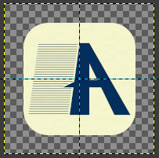

# Axion Notes


A cross-platform sticky notes desktop app built with ReactJS and Electron by SolisWare.

---

### Early release notice
> SolisWare Axion Notes is currently pre-1.0 software. Features, storage formats, settings, and app behavior may change between releases, and backward compatibility is not guaranteed until a stable 1.0 release.
>
> When updating between early releases, locally stored notes or settings may not always migrate cleanly. Please keep a backup of anything important before installing a new version.

---

## Getting Started

### Download & Install
 
Download the latest prebuilt release for your platform from the [Releases](https://github.com/solisware/sticky-notes-desktop/releases) page.
 
> **macOS users:** If you see a *"Axion Notes is damaged and can't be opened"* warning after downloading, this is macOS Gatekeeper blocking the app because it is not yet signed with an Apple Developer certificate. The app itself is fine. Run the following command in Terminal to fix it:
> ```bash
> xattr -cr "/Applications/Axion Notes.app"
> ```
>
> **Windows users:** If you see a *"Windows protected your PC"* warning after downloading, this is Microsoft Defender SmartScreen blocking the installer because it is new or not yet widely recognized. The app itself is fine. Click **More info**, then click **Run anyway** to continue the installation.

---

## Contributing
Contributions are welcome — whether that's bug fixes, new features, documentation improvements, or raising issues and feature requests.

### Raising Issues & Feature Requests
Found a bug or have an idea? [Open an issue](https://github.com/SolisWare/sticky-notes-desktop/issues) and describe it clearly. For feature requests, explain the use case and why it would be valuable.

### Submitting a Pull Request
1. Fork the repository
2. Create a feature branch from `develop`:
   ```bash
   git checkout -b feature/your-feature-name
   ```
3. Make your changes and commit with clear, descriptive messages
4. Push your branch and open a Pull Request against `develop` branch

### PR Review Policy
All pull requests must be reviewed and approved by the **SolisWare team** before merging. We aim to review PRs promptly. Please be patient — we appreciate your effort.

---

## Development

### Prerequisites
> These are required for development only. The distributed app bundles its own runtime — end users do not need Node.js installed.

- [Node.js](https://nodejs.org/) v18 or higher
- npm v9 or higher

### Clone the Repository
```bash
git clone https://github.com/solisware/sticky-notes-desktop.git
cd axion-notes
npm install
```

### Run in Development Mode
```bash
npm run electron:dev
```

This starts the React dev server and Electron concurrently. The app will reload automatically on code changes.
> **Note:** Changes to any files inside `electron` directory require a full restart of the dev process to take effect.

### Project Structure
```
axion-notes/
├── electron/          # Electron main process, preload, and menu
├── src/               # React renderer (components, pages, theme, models)
├── assets/            # App icons and installer assets
├── docs/              # Project documentation and README images
├── build/             # Compiled output (generated, do not edit or commit)
├── dist/              # Distribution packages (generated, do not edit or commit)
└── public/            # Static assets for the React app
```

### Version Numbers
Version metadata is managed in `app-version-config.json`.

After changing any release value, run:
```bash
npm run version-numbers
```

This updates:
- `package.json`
- `package-lock.json`
- the version badge in `README.md`

Accepted `app-version-config.json` values:

| Value | Type | Description |
| --- | --- | --- |
| `majorVersion` | `number` | Required major version number. Example: `1` in `1.2.0`. |
| `minorVersion` | `number` | Required minor version number. Example: `2` in `1.2.0`. |
| `patchVersion` | `number` | Required patch version number. Example: `0` in `1.2.0`. |
| `preReleaseVersion` | `string` | Optional prerelease suffix appended as `-<value>`. Example: `beta.1` -> `0.1.0-beta.1`. |
| `buildVersion` | `string` | Optional build suffix appended as `-b<value>`. Example: `123` -> `0.1.0-b123`. |
| `releaseCodename` | `string` | Optional label shown in the app About dialog. This does not change the package version number. |

Example:
```json
{
  "majorVersion": 0,
  "minorVersion": 1,
  "patchVersion": 0,
  "preReleaseVersion": "beta.1",
  "buildVersion": "123",
  "releaseCodename": "Unreleased Milestone"
}
```

With the example above, the generated app version becomes `0.1.0-beta.1-b123`.

Build version precedence:
- `GITHUB_RUN_NUMBER` environment variable if present
- `buildVersion` from `app-version-config.json`
- no build suffix if neither is present

---

## Building for Production
 
Build the app:
```bash
npm run build
```
> **Important:** Run `npm run build` manually before running any `dist` target. The distribution commands do not build the app for you.
 
### Distribute for macOS (Apple Silicon)
```bash
npm run dist-mac-arm64
```
Output: `dist/` — produces a `.dmg` installer.

### Distribute for macOS (Intel)
```bash
npm run dist-mac-x64
```
Output: `dist/` — produces a `.dmg` installer.

### Distribute for Windows (64-bit)
```bash
npm run dist-windows-x64
```
Output: `dist/` — produces an NSIS `.exe` installer.

### Distribute for Windows (32-bit)
```bash
npm run dist-windows-x86
```
Output: `dist/` — produces an NSIS `.exe` installer.

---

## Creating App Icons

App icons must be drawn with padding around the artwork. Do not fill the entire canvas with the icon shape. The artwork should be centered both horizontally and vertically so the icon has even breathing room on every side.



Use the SVG icon as the primary source wherever possible. SVG scales cleanly and is widely used across the app and web-facing metadata. Fixed PNG files are mainly generated outputs for places that require raster icons, such as favicons, web app manifest icons, installer metadata, and platform packaging.

Use these canvas and artwork sizes:

| Canvas size | Icon artwork size | Total padding | Padding per side | Artwork ratio |
| --- | --- | --- | --- | --- |
| `192 x 192` | `143 x 143` | `49 px` | `24.5 px` | `74.5%` |
| `512 x 512` | `433 x 433` | `79 px` | `39.5 px` | `84.6%` |
| `1024 x 1024` | `865 x 865` | `159 px` | `79.5 px` | `84.5%` |

For the larger icons, use an artwork-to-canvas ratio of about `0.845`. In other words:

```text
artwork size = canvas size * 0.845
padding per side = (canvas size - artwork size) / 2
```

The platform app icon formats are:

| Platform | Required icon format |
| --- | --- |
| macOS | `.icns` |
| Windows | `.ico` |

These platform icon files should be generated from the padded `1024 x 1024` source artwork using an icon generator such as [Markifo](https://markifo.com). App icons and generated icon files used by the application should stay in `public/` or `assets/`, depending on how they are consumed by the build.

---

## License
Axion Notes is open source software licensed under the [MIT License](LICENSE.txt).
 
You are free to use, modify, and distribute this software. Attribution is not required but is greatly appreciated — if you use our code in your project, a mention or a link back to this repository means a lot to us.
